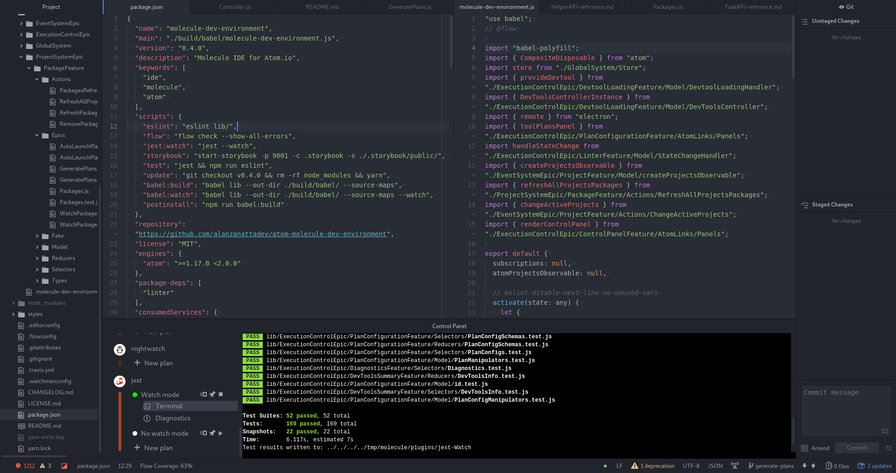

Molecule IDE
============

Molecule is a package that transforms [Atom](https://atom.io/) into a full-blown [Integrated Development Environment](https://en.wikipedia.org/wiki/Integrated_development_environment)
(or IDE).

Learn more [on our website](http://www.molecule.sh/) or read
[our documentation](http://www.molecule.sh/docs/getting-started-introduction.html)
to get started!



Features
--------

While keeping Atom's intuitive, customizable approach, Molecule adds the
expected features of an IDE to Atom:

* In-editor compilation
* Code analysis
* Error diagnostics

The key advantage of Molecule over monolithic IDEs is its potential for
adaptation: where most IDEs are only valid for a few programming langages or
environments, developers can easily add plug-ins to Molecule (as Atom packages).
Users are able to download the plug-ins to adapt to new langages, without having
to change their IDE, habits, settings, keybindings, etc.

**Warning:** Molecule is still in a beta stage. The current state still has bugs
and UI problems, and features are still being implemented. We are working hard
on this project, and we welcome all the [feedback](#feedback) you can give us!

Installation
------------

- **[Install Atom](http://flight-manual.atom.io/getting-started/sections/installing-atom/) version 1.17.0 or higher**

- **Install [Watchman](https://facebook.github.io/watchman/)**

- *(MacOS only)* **Install *XCode Command Line Tools* (run `xcode-select --install` in the terminal)
or [XCode](https://itunes.apple.com/fr/app/xcode/id497799835)**

- **Install Molecule**

  Molecule is available on `apm` (the official tool for downloading Atom
  packages). Run `apm install molecule`, or install Molecule from your package
  browser (`ctrl-shift-p Install Packages And Themes`).


Molecule should then be installed the next time you start Atom.

Contribute
----------

### Feedback

We are open to any kind of feedback you could give us. From bug fixes to
recommandations and feature requests, we would love to hear what you think of
Molecule.

Create a
[GitHub issue](https://github.com/alanzanattadev/atom-molecule-dev-environment)
to communicate with the Molecule team.

We love discussing with our users!

### Make a plugin

Consult the
[Plugin API](http://www.molecule.sh/docs/plugin-creator-create-plugin.html)
for details.

### Help develop Molecule

[Comment]: # (TODO - ADD LINK TO DEVELOPER DOC)

In order to contribute to Molecule, you need to clone the latest version of this
repository and install it in
[development mode](https://flight-manual.atom.io/hacking-atom/sections/hacking-on-atom-core/#running-in-development-mode),
using the `apm` command line.

```
git clone https://github.com/alanzanattadev/atom-molecule-dev-environment.git
cd atom-molecule-dev-environment
npm install
apm link -d
```
